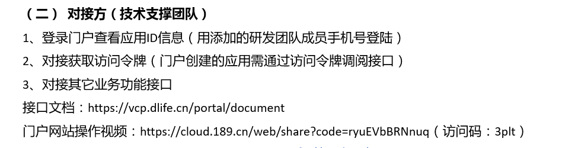
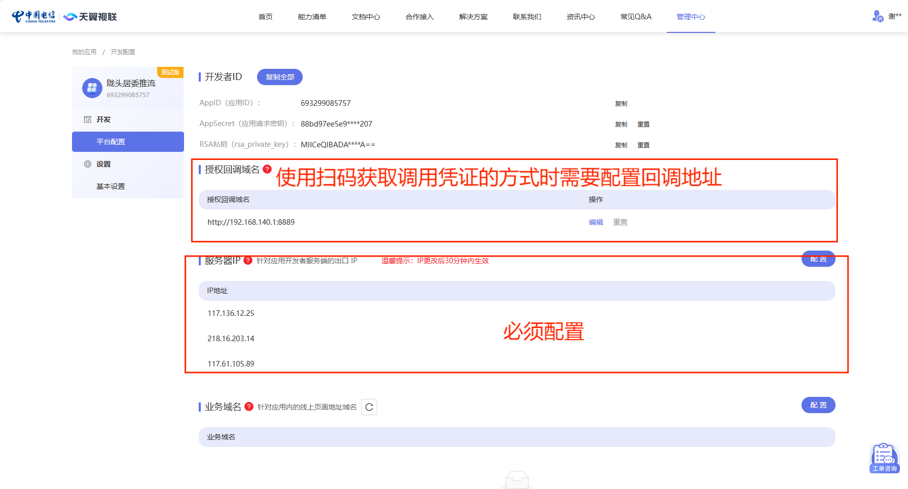
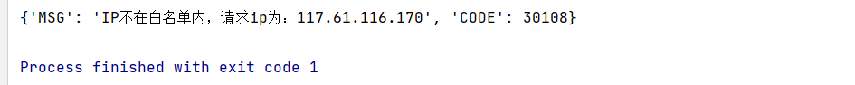
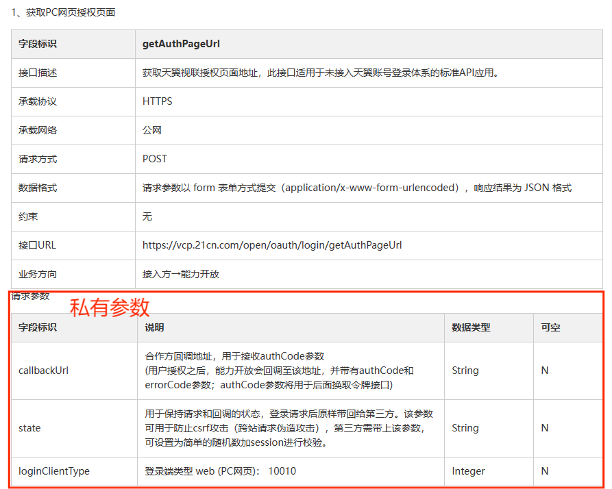
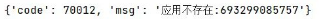
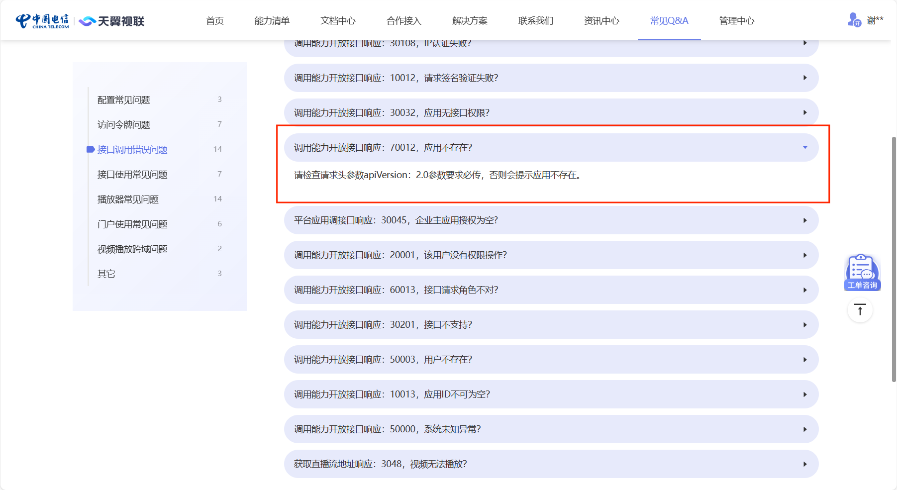
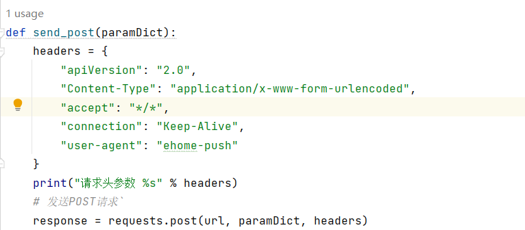
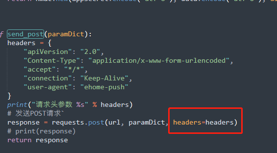

### **接口使用流程**
-----------------------



#### 一、获取 accessToken（访问令牌） 

**1、运行 getAuthCode.py 得到authCode （*只有当 errcode=0 时，authCode 才能用*）**

**2、用第1步得到的authCode替换 getAccessToken.py 中旧的authCode，然后运行该文件得到accessToken  **

#### 二、调用api（其他业务功能）

**按照文档将accessToken传入需要调用的api的参数中**

*tip：accessToken的有效时长为24小时*

#### 三、相关配置



**1、授权时回调域名的配置：授权域名可接受 “协议://域名” 和 “协议:// IP +端口” 两种形式，其中无论何种形式记得必须填写 “协议” 关键信息**

**2、服务器 IP 的配置：当发送请求时出现下图的报错信息时，将报错信息中的 IP 添加到上图的服务器 IP 中即可**



### **问题复盘**

---------------

#### 问题1：请求体参数

使用*天翼视联平台* 提供的接口时，需要注意该平台的请求体参数包括私有参数和共有参数。私有参数可以在对应接口的说明文档中找到。如下图所示：



共有参数（使用该平台的任何接口时都要加上，处理过程参考示例）

| 字段标识   |                   说明                   | 数据类型 |
| ---------- | :--------------------------------------: | -------- |
| signature  |     signature签名时注意各字段的顺序      | String   |
| params     | 使用appSecret对所有私有参数进行XXTea加密 | String   |
| appId      |          平台分配给应用的AppID           | String   |
| version    |            服务端版本号：2.0             | String   |
| clientType |        客户端类型：3-PC；4-服务器        | Integer  |
| timestamp  |                  时间戳                  | Long     |


参数处理得到最终的请求体参数(以getAuthPageUrl接口为例)

```python
# 共有参数与加密所需参数（appSecret）
appId = "693299085757"
appSecret = "88bd97ee5e9949c2bc48efb6e6fa2207"
CLIENT_TYPE = 3
VERSION = "2.0"

callbackUrl = "http://192.168.140.1:8889" # 私有参数callbackUrl（需要在平台进行配置）
loginClientType = 10010 # 私有参数loginClientType

def public_params(params):
    """ 共有请求参数 """
    timestamp = int(time.time() * 1000)
    return {"signature": get_sign(params, timestamp), "params": params, "appId": appId,
                "version": VERSION,  "clientType": CLIENT_TYPE, "timestamp": timestamp}

def get_sign(params, timestamp):
    """ 获取签名 """
    data = appId+str(CLIENT_TYPE)+str(params)+str(timestamp)+VERSION
    # print(data)
    return hmac.new(appSecret.encode('utf-8'), data.encode('utf-8'), digestmod=sha256).hexdigest()


def generate_state(length=16):
    """处理state私有参数"""
    characters = string.ascii_letters + string.digits
    return ''.join(random.choice(characters) for i in range(length))


def main():
    
    state = generate_state()  # 私有参数state（随机生成符合规定的state）
    
    # 私有参数拼接与加密
    reqParam = "callbackUrl=%s&state=%s&loginClientType=10010" % (callbackUrl, state)
    param = xxtea.encrypt(reqParam, appSecret).hex()
    
    # 加密后的私有参数与共有参数拼接（realParam为最终发送请求需要的请求体参数）
    realParam = public_params(param)
    
```

**该平台中其他接口的请求体参数处理与示例大同小异，只需要按照对应接口的文档的说明处理私有参数部分即可**


#### 问题2：70012错误码（应用不存在），按照文档说明进行处理后仍然报错

处理完请求体参数后发送请求时，报错 70012。



文档给出的解决方案：



该方案是可行的，但是要注意发请求时参数的对齐，确保将处理好的请求头参数放入到正确的位置，具体处理过程参考下图





tips：使用过程中如若有其他的错误码，可以到平台的Q&A找具体的解决办法


### 完整的参考代码

-------------

获取调用凭证时向 getAuthPageUrl 发送请求

```python
import requests
import random
import string
import time
import xxtea  # 下载的的是这个xxtea-py，不是xxtea
import hmac
import json
from hashlib import sha256


# 接口URL
url = "https://vcp.21cn.com/open/oauth/login/getAuthPageUrl"

# 共有参数与加密所需参数（appSecret）
appId = "693299085757"
appSecret = "88bd97ee5e9949c2bc48efb6e6fa2207"
CLIENT_TYPE = 3
VERSION = "2.0"

callbackUrl = "http://192.168.140.1:8889" # 私有参数callbackUrl（需要在平台进行配置）
loginClientType = 10010 # 私有参数loginClientType

def public_params(params):
    """ 共有请求参数 """
    timestamp = int(time.time() * 1000)
    return {"signature": get_sign(params, timestamp), "params": params, "appId": appId,
                "version": VERSION,  "clientType": CLIENT_TYPE, "timestamp": timestamp}

def get_sign(params, timestamp):
    """ 获取签名 """
    data = appId+str(CLIENT_TYPE)+str(params)+str(timestamp)+VERSION
    # print(data)
    return hmac.new(appSecret.encode('utf-8'), data.encode('utf-8'), digestmod=sha256).hexdigest()


def generate_state(length=16):
    """处理state私有参数"""
    characters = string.ascii_letters + string.digits
    return ''.join(random.choice(characters) for i in range(length))


def send_post(paramDict):
    """发送请求"""
    
    # 请求头参数
    headers = {
        "apiVersion": "2.0",
        "Content-Type": "application/x-www-form-urlencoded",
        "accept": "*/*",
        "connection": "Keep-Alive",
        "user-agent": "ehome-push"
    }
    
    # print("请求头参数 %s" % headers)
    
    # 发送POST请求`
    repsonse = requests.post(api_url, paramDict, headers=headers)
    # print(response)
    
    return response


def main():

    state = generate_state()
    reqParam = "callbackUrl=%s&state=%s&loginClientType=10010" % (callbackUrl, state)

    param = xxtea.encrypt(reqParam, appSecret).hex()
    realParam = public_params(param)
    result = send_post(realParam)
    # print("请求体参数:%s" % realParam )

    # print("result.content=%s" % (result.content).decode('utf-8'))
	# 将响应参数使用json格式加载到value
    value = json.loads(result.text)
    print(value)


if __name__ == '__main__':
    main()
```
